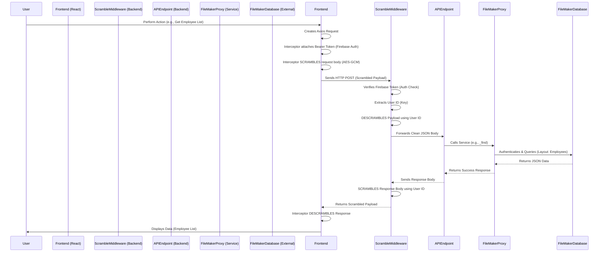

# BikeSalesErp Documentation & Deployment Guide

This document covers the Environment Setup, Data Flow, and details regarding Firebase Deployment and Java installation.

## 1. System Architecture & Data Flow

The application connects a React Frontend to a FileMaker Database via a Firebase Cloud Functions backend. Data is scrambled for security.

### Data Flow Diagram



---

## 2. Environment Setup

### Frontend (.env.local)

Located in `d:\BikeSalesErp\frontend\.env.local`

| Variable | Value | Description |
| :--- | :--- | :--- |
| `VITE_API_URL` | `http://127.0.0.1:5002/bikesakes/us-central1/api` | **Debug Server** Port (Running `node debug-server.js`) |
| `VITE_API_URL` | `http://127.0.0.1:5001/bikesakes/us-central1/api` | **Firebase Emulators** Port (Running `firebase emulators:start`) |

**Important:** You must restart the frontend (`npm run dev`) after changing this file.

### Backend (.env)

Located in `d:\BikeSalesErp\functions\.env`

| Variable | Description |
| :--- | :--- |
| `FILEMAKER_HOST` | External IP/Domain of FileMaker Server |
| `FILEMAKER_USER` | API User Account Name |
| `FILEMAKER_PASSWORD` | API User Password |
| `FILEMAKER_DATABASE` | Targeted Database Name |

---

## 3. Firebase Deployment & Local Testing

### Local Environments

You have two ways to run the backend locally:

1.  **Debug Server (Current Recommended Fallback)**
    *   **Command**: `node debug-server.js` (Run in `functions/` folder)
    *   **Port**: 5002
    *   **Pros**: Doesn't require Java. Fast startup. Patched to extract tokens correctly.
    *   **Cons**: Is a manual script, not the exact production environment.

2.  **Firebase Emulators (Production-Like)**
    *   **Command**: `firebase emulators:start` (Run in root folder)
    *   **Port**: 5001
    *   **Pros**: Runs the exact `index.js` logic as deployed. Simulates Auth/Firestore.
    *   **Cons**: **REQUIRES JAVA** installed. Slower startup.

### Installing Java for Emulators

To run the Firebase Emulators, you need the Java Runtime Environment (JRE). You can install it via Command Prompt (Admin) using `winget`:

```cmd
winget install Microsoft.OpenJDK.21
```
*After installation, close and reopen your terminal.*

### How to Set Java Environment Variables (If needed)

If `firebase emulators:start` still complains about Java after installing, set the path manually:

**Option 1: PowerShell (Run as Administrator)**
```powershell
[System.Environment]::SetEnvironmentVariable("JAVA_HOME", "C:\Program Files\Microsoft\jdk-21.0.10.7-hotspot", "Machine")
$currentPath = [System.Environment]::GetEnvironmentVariable("Path", "Machine")
if ($currentPath -notlike "*%JAVA_HOME%\bin*") {
    [System.Environment]::SetEnvironmentVariable("Path", "$currentPath;%JAVA_HOME%\bin", "Machine")
}
Write-Host "Java Path Set! Please requestart your terminal."
```

**Option 2: Windows GUI**
1.  Search for **"Edit the system environment variables"** in the Start Menu.
2.  Click **"Environment Variables..."**.
3.  Under **System variables** (bottom section):
    *   Click **New...** -> Variable Name: `JAVA_HOME`, Variable Value: `C:\Program Files\Microsoft\jdk-21.0.10.7-hotspot`
    *   Find the **Path** variable -> Select it -> Click **Edit...**
    *   Click **New** -> Type `%JAVA_HOME%\bin` -> Click OK.
4.  Click OK on all windows.
5.  **Restart your terminal** (or VS Code).

---

## 4. Production Readiness: Firebase Free Tier vs Blaze Plan

The user asked: *"Will everything work when we go to production on Firebase free tier?"*

**Answer: NO.**

### Why?
The **Spark Plan (Free Tier)** blocks all **outbound networking** to non-Google services.
*   Your app needs to connect to `208.85.249.216` (FileMaker).
*   **The Spark Plan will BLOCK this connection.**

### What to do?
You must upgrade to the **Blaze Plan (Pay as you go)**.
*   **Good News**: The free usage limits on the Blaze plan are identical to the Free Tier for most services.
*   **Cost**: For a small internal ERP, you will likely pay **$0.00/month**.

### Blaze Plan Free Limits (Resets Monthly)
| Service | Free Limit | Overage Cost |
| :--- | :--- | :--- |
| **Cloud Functions** | 2,000,000 invocations | $0.40 / million |
| **Compute Time** | 400,000 GB-seconds | Varies by CPU/RAM |
| **Networking** | 5 GB Outbound Data | $0.12 / GB |
| **Build Time** | 120 minutes/day | $0.003 / minute |

**Summary**: Unless you are hitting these API endpoints millions of times a month, **it will be free**. But the credit card is required to unlock the network.

